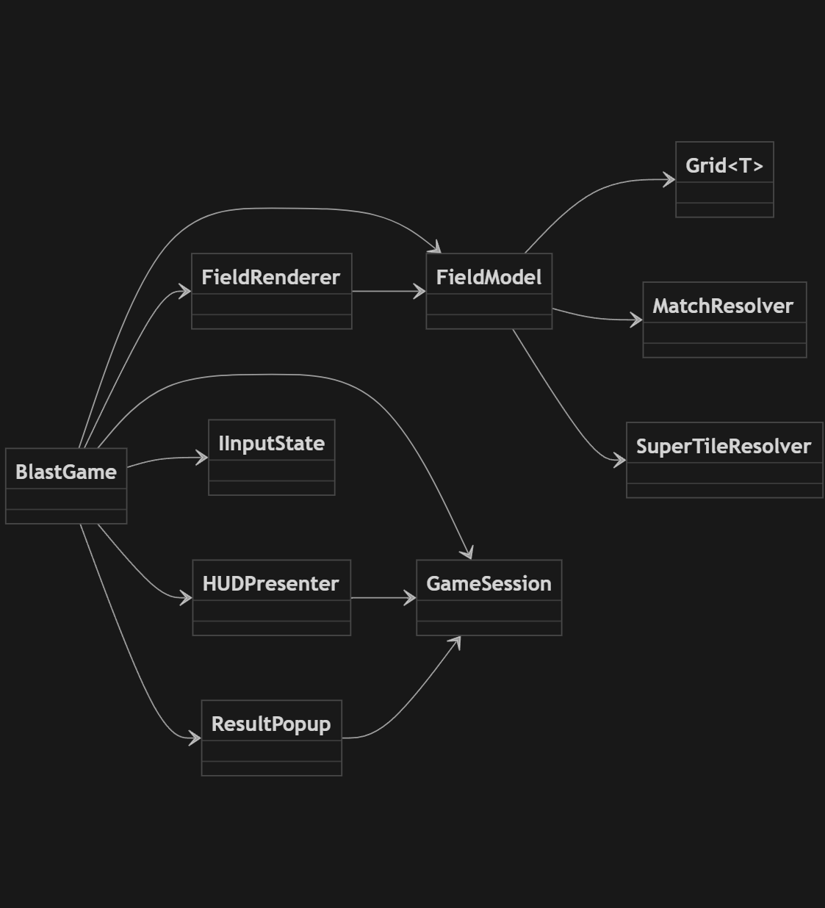

# BlastTest — Cocos Creator 2.4.x, TypeScript

Прототип игры с механикой Blast (match-2): кликай по группе смежных тайлов одного цвета, зарабатывай очки, используй бустеры и супер-тайлы.

## Ссылка на Pages
https://daniildongiv.github.io/BlastTestCocos/

## GIF демо

  

## Геймплей
- Цель: `TARGET_SCORE` очков за `MAX_MOVES` ходов (`config/GameConfig.ts`).
- Клик по группе ≥ `MIN_GROUP_SIZE` — сжигает группу, гравитация и спавн.
- Супер-тайлы по порогам (`GameConfig`): строка, столбец, радиус, всё поле.
- Бустеры: бомба (`BOMB_RADIUS`), телепорт (swap).
- Авто-шафл до `MAX_SHUFFLES`, далее поражение.

## Скриншоты

<table>
  <tr>
    <th>Геймплей</th>
    <th>Победа</th>
    <th>Поражение</th>
  </tr>
  <tr>
    <td></td>
    <td></td>
    <td></td>
  </tr>
</table>

## FSM таблица

  

## Архитектура (слои)
- `assets/Scripts/core/` — доменная логика без зависимостей от Cocos (FieldModel, GameSession, MatchResolver, типы)
- `assets/Scripts/input/` — обработка ввода (State-паттерн)
- `assets/Scripts/strategies/` — эффекты супер-тайлов (Strategy-паттерн)
- `assets/Scripts/rendering/` — визуал и анимации (FieldRenderer, HUDPresenter, TileRenderer, ResultPopup)
- `assets/Scripts/config/` — константы игры (`GameConfig`)
- `assets/Scripts/BlastGame.ts` — фасад/оркестратор подсистем

## Паттерны/принципы
- Facade (`BlastGame`), State (ввод), Strategy (супер-тайлы), DIP (`IFieldQuery`).
- SOLID, разделение логики и визуала.
- Анимации: `async/await` + `Promise.all`.

## Кнопки (через сцену)
1. На `BoosterBombPanel` и `BoosterTeleportPanel` — `cc.Button`.
2. Публичные хендлеры в `BlastGame`: `onBombClicked`, `onTeleportClicked`.
3. В `Button.Click Events`: Target — нода с `BlastGame`, Component — `BlastGame`, Handler — метод.